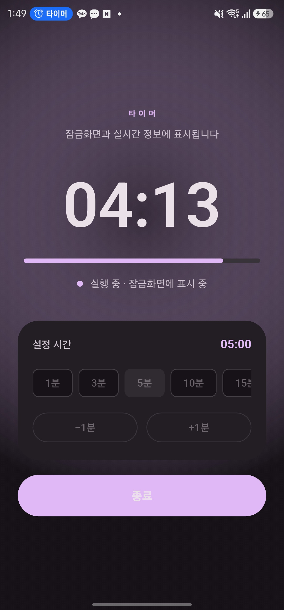
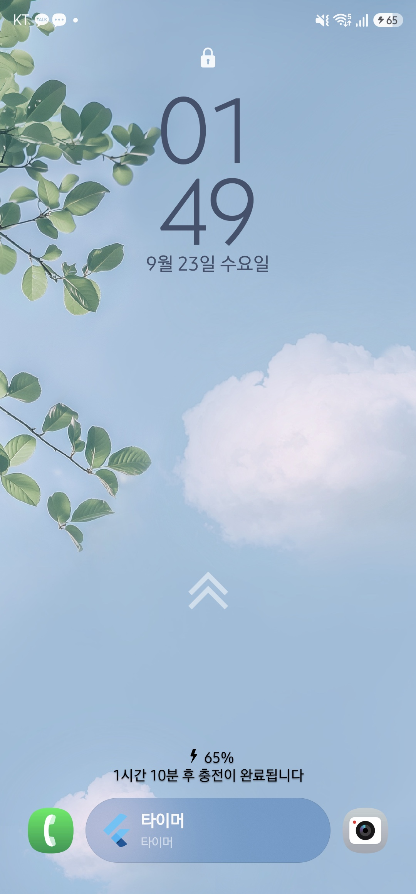
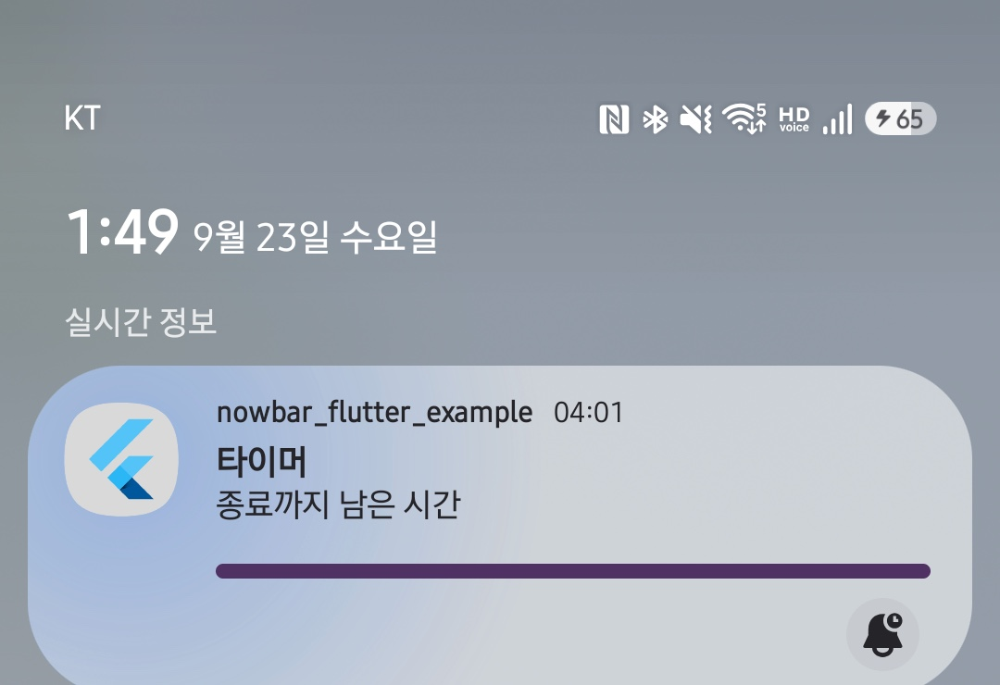

English | [한국어](README.ko.md)

# nowbar_flutter

[](https://github.com/winwin-ai/nowbar_flutter/actions/workflows/ci.yml)
[](https://pub.dev/packages/nowbar_flutter)

> **Status: 0.2.x (pre-1.0).** The package is published on pub.dev. The public
> API described below is frozen for the 0.2 line; the surface widgets are demo
> components, not live system integrations.

This repository holds two things: the `nowbar_flutter` package and the Android
16 Live Update timer app under [`example/`](example). `nowbar_flutter` is a
pure-Dart Flutter recreation of the Samsung Now Bar, a compact, draggable card
deck that stacks animated surfaces for media, notifications, routines, sports,
and timers. The package documentation is the main body of this file, and the
example app has its own section right below.

## Android 16 Live Update timer

The app under [`example/`](example) is a countdown timer that drives an Android
16 Live Update, a promoted ongoing notification. Set a duration with the 1, 3,
5, 10, 15, 30, or 60-minute presets, or fine-tune it with the `−1분` / `+1분`
steppers (1 minute to 4 hours), then press `시작` to start and `종료` to stop.

While the countdown runs, it appears in three places: the notification shade's
**"Live info" (실시간 정보)** section, a lock-screen Now Bar card, and a
status-bar chip.

<p align="center">  </p>

The example app owns the integration through its own `nowbar/live_timer`
method channel. `start` takes `{seconds, totalSeconds}`, and `stop` ends the
update. Live Updates require Android 16 or newer, and the example manifest
declares `POST_NOTIFICATIONS` and `POST_PROMOTED_NOTIFICATIONS`.

To run it:

```sh
cd example
flutter run
```

See [`example/README.md`](example/README.md) for the channel contract. This
Live Update integration lives **in the example app only** and does not change
the package's presentation-only scope.

## Features

- **Draggable, stacked card deck.** Components cycle through a bottom-aligned
  surface with configurable drag directions.
- **Five built-in demo widgets:** media player, notification, routines, sports,
  and timer.
- **Pure Dart, zero native code.** No platform channels, no plugins, no
  `MethodChannel`; Android is the only supported target.
- **Full layout control** through immutable `NowBarMetrics` (corner radius,
  height, translation clamp, shadow, width fraction, animation speed).
- **Theming.** Material 3 color schemes ported from the reference design, plus
  `seedColor` support for a custom palette, in light and dark.
- **Bundled Inter typeface** (Regular 400, SemiBold 600, Bold 700), no font
  download required.
- **Swappable component surfaces** via `NowBarComponent.builder`, so you can
  drop in any widget you like.

## Requirements

| Requirement | Version |
| --- | --- |
| Flutter | `>= 3.10.0` |
| Dart SDK | `^3.0.0` |
| Platform | Android |

The package is pure Dart. It declares no platform plugins and calls no native
code, so it needs no platform-specific setup on Android.

## Installation

The package is published on pub.dev:

```sh
flutter pub add nowbar_flutter
```

Or add it to `pubspec.yaml` directly:

```yaml
dependencies:
  nowbar_flutter: ^0.1.1
```

You can also depend on the repository directly:

```yaml
# Path dependency (local checkout)
dependencies:
  nowbar_flutter:
    path: ../nowbar_flutter
```

```yaml
# Git dependency
dependencies:
  nowbar_flutter:
    git:
      url: https://github.com/winwin-ai/nowbar_flutter.git
      ref: main
```

The repository is public, so the git dependency is reachable directly.

## Quick start

The example below is complete and runnable. It installs the Now Bar theme,
places the bar at the bottom of the screen, and registers three components.

```dart
import 'package:flutter/material.dart';
import 'package:nowbar_flutter/nowbar_flutter.dart';

void main() => runApp(const NowBarExampleApp());

class NowBarExampleApp extends StatelessWidget {
  const NowBarExampleApp({super.key});

  @override
  Widget build(BuildContext context) {
    return MaterialApp(
      title: 'Now Bar Demo',
      debugShowCheckedModeBanner: false,
      home: NowBarTheme(
        darkTheme: true,
        child: Scaffold(
          backgroundColor: Colors.black,
          body: SafeArea(
            child: Align(
              alignment: Alignment.bottomCenter,
              child: NowBarWidget(
                innerPadding: const EdgeInsets.fromLTRB(16, 0, 16, 24),
                dragDirection: NowBarDragController.dragVertically,
                metrics: const NowBarMetrics(
                  cornerRadius: 32,
                  widgetHeight: 88,
                ),
                widgets: [
                  NowBarComponent(
                    builder: () => MediaPlayerWidget(
                      tracks: [
                        MediaPlayerTrack(
                          image: const NetworkImage(
                            'https://picsum.photos/seed/nowbar/200',
                          ),
                          title: 'Midnight City',
                          artist: 'M83',
                        ),
                      ],
                    ),
                  ),
                  NowBarComponent(
                    builder: () => const NotificationWidget(
                      icon: Icon(NowBarIcons.check),
                      title: 'Order shipped',
                      content: 'Your package is on the way',
                    ),
                  ),
                  NowBarComponent(
                    builder: () => const RoutinesWidget(content: 'Run 5 km'),
                    dismissible: false,
                  ),
                ],
              ),
            ),
          ),
        ),
      ),
    );
  }
}
```

Notes:

- `NowBarComponent` takes a `Widget Function()`, so pass a closure
  (`builder: () => ...`). Function literals are not constants, so the
  `widgets` list itself cannot be `const`.
- Replace the `NetworkImage` with an `AssetImage`, `FileImage`, or any other
  `ImageProvider` for your own artwork.

## API reference

All types below are exported from `package:nowbar_flutter/nowbar_flutter.dart`.

### `NowBarWidget`

The root surface that hosts and rotates the active component.

```dart
NowBarWidget({
  Key? key,
  EdgeInsets innerPadding = EdgeInsets.zero,
  required List<NowBarComponent> widgets,
  NowBarMetrics metrics = const NowBarMetrics(),
  NowBarDragController dragDirection = NowBarDragController.dragUp,
})
```

| Parameter | Type | Default | Description |
| --- | --- | --- | --- |
| `innerPadding` | `EdgeInsets` | `EdgeInsets.zero` | Padding applied inside the bar surface. |
| `widgets` | `List<NowBarComponent>` | required | The components in the rotation, in display order. |
| `metrics` | `NowBarMetrics` | `const NowBarMetrics()` | Layout and motion metrics. |
| `dragDirection` | `NowBarDragController` | `NowBarDragController.dragUp` | Gesture direction the surface responds to. |

### `NowBarComponent`

One entry in the rotation: a builder for the surface content and a dismissal
flag.

```dart
NowBarComponent({
  required Widget Function() builder,
  bool dismissible = true,
})
```

| Parameter | Type | Default | Description |
| --- | --- | --- | --- |
| `builder` | `Widget Function()` | required | Builds the widget shown while this component is active. |
| `dismissible` | `bool` | `true` | Whether a swipe can remove this component from the rotation. |

Equality is identity-based: each component owns a distinct builder, and the
rotation tracks entries by object identity.

### `NowBarMetrics`

Immutable layout and animation metrics. Every field defaults to the reference
design value.

```dart
const NowBarMetrics({
  double cornerRadius = 50,
  double widgetHeight = 80,
  (double, double) translationClamp = (-200, 250),
  double shadowElevation = 12,
  double fillMaxWidthOffset = 0.9,
  int animationMultiplier = 1,
})
```

| Field | Type | Default | Description |
| --- | --- | --- | --- |
| `cornerRadius` | `double` | `50` | Corner radius of the bar surface, in logical pixels. |
| `widgetHeight` | `double` | `80` | Height of a single surface, in logical pixels. |
| `translationClamp` | `(double, double)` | `(-200, 250)` | Lower and upper bounds for vertical drag translation, in physical pixels. The first value clamps upward movement, the second downward. |
| `shadowElevation` | `double` | `12` | Elevation of the bar's shadow, in logical pixels. |
| `fillMaxWidthOffset` | `double` | `0.9` | Fraction (0 to 1) of the available width the bar occupies when maximized. |
| `animationMultiplier` | `int` | `1` | Integer multiplier for animation durations. Values above `1` slow motion down, below `1` speed it up. |

> **Units.** The vertical translation, its clamp, the stack offsets, and the
> drag thresholds are **physical pixels**, matching the reference
> implementation, so vertical travel and card stacking behave the same as the
> original across display densities. The corner radius, height, and shadow are
> **logical pixels**.

Use `copyWith` to derive a variant without mutating the original:

```dart
const base = NowBarMetrics();
final compact = base.copyWith(widgetHeight: 64, cornerRadius: 24);
```

### `NowBarDragController`

The gesture direction a surface responds to.

| Value | Description |
| --- | --- |
| `dragUp` | Only upward drags advance to the next component. |
| `dragDown` | Only downward drags step back to the previous component. |
| `dragVertically` | Both upward and downward drags step through components. |
| `dragHorizontally` | No vertical cycling only; horizontal swipe-to-dismiss is still available when the active component is `dismissible` (see below). |

### `NotificationColorController`

An immutable palette for a notification surface: background (solid or
gradient), icon, title, and content colors. Despite the name, it is a value
object, not a live controller. Use `copyWith` to derive a variant.

```dart
const NotificationColorController({
  Color backgroundColor = Color(0xFF303164),
  Gradient? backgroundColorGradient,
  Color iconColor = Colors.white,
  Color titleColor = Colors.white,
  Color contentColor = Colors.white,
})
```

| Field | Type | Default | Description |
| --- | --- | --- | --- |
| `backgroundColor` | `Color` | `Color(0xFF303164)` | Solid background, used when `backgroundColorGradient` is `null`. |
| `backgroundColorGradient` | `Gradient?` | `null` | Optional gradient; when set it takes precedence over `backgroundColor`. |
| `iconColor` | `Color` | `Colors.white` | Color of the leading icon. |
| `titleColor` | `Color` | `Colors.white` | Color of the title. |
| `contentColor` | `Color` | `Colors.white` | Color of the body text. |

### `NowBarTheme`

Wraps `child` in a Material theme configured with the ported Now Bar color
scheme and typography, so descendants can read colors and text styles through
`Theme.of(context)`.

```dart
const NowBarTheme({
  Key? key,
  required Widget child,
  bool darkTheme = false,
  Color? seedColor,
})
```

| Parameter | Type | Default | Description |
| --- | --- | --- | --- |
| `child` | `Widget` | required | The subtree the theme applies to. |
| `darkTheme` | `bool` | `false` | Selects the dark scheme. `false` applies the light scheme. |
| `seedColor` | `Color?` | `null` | Generates a custom Material 3 scheme from this color. When `null`, the ported Now Bar palette is used. |

Named constructors:

| Constructor | Description |
| --- | --- |
| `NowBarTheme.light({...})` | Always uses the light scheme. |
| `NowBarTheme.dark({...})` | Always uses the dark scheme. |

Static builder:

```dart
static ThemeData buildThemeData({bool dark = false, Color? seedColor})
```

`buildThemeData` returns the `ThemeData` the wrapper applies. It is named
`buildThemeData` rather than `build` because Dart forbids a static member from
sharing the inherited instance `build` method's name. Use it when you need to
compose the theme into your own `MaterialApp`:

```dart
MaterialApp(
  theme: NowBarTheme.buildThemeData(),
  darkTheme: NowBarTheme.buildThemeData(dark: true),
  home: const HomePage(),
)
```

### `NowBarColors`

Color seeds and the two Material 3 color schemes used by Now Bar surfaces.

| Member | Type | Value |
| --- | --- | --- |
| `purple80` | `Color` | `Color(0xFFD0BCFF)` |
| `purpleGrey80` | `Color` | `Color(0xFFCCC2DC)` |
| `pink80` | `Color` | `Color(0xFFEFB8C8)` |
| `purple40` | `Color` | `Color(0xFF6650A4)` |
| `purpleGrey40` | `Color` | `Color(0xFF625B71)` |
| `pink40` | `Color` | `Color(0xFF7D5260)` |
| `lightColorScheme` | `ColorScheme` | Material 3 light scheme with the reference `primary`/`secondary`/`tertiary` seeds pinned. |
| `darkColorScheme` | `ColorScheme` | Material 3 dark scheme with the reference seeds pinned. |

Android 12+ dynamic color from the reference theme is intentionally omitted:
wallpaper-derived color has no portable Flutter equivalent, so these schemes
are stable across Android devices.

### `NowBarTypography`

Typography used by Now Bar surfaces. The three overridden styles preserve the
reference metrics, deriving Flutter's `TextStyle.height` from the reference's
absolute line height.

| Member | Type | Description |
| --- | --- | --- |
| `fontFamily` | `const String` | The bundled family name, `'Inter'`. |
| `bodyLarge` | `TextStyle` | Inter Regular, 16px, 24px line box, `0.5` letter spacing. |
| `titleLarge` | `TextStyle` | Inter Bold, 22px, 28px line box, no letter spacing. |
| `labelSmall` | `TextStyle` | Inter SemiBold, 11px, 16px line box, `0.5` letter spacing. |
| `textTheme` | `TextTheme` | The full Material 3 text theme with Inter applied and the three styles above overridden. |

### `NowBarIcons`

A neutral icon catalog mapped to the closest Material icons. The package ships
no branded artwork.

| Member | `IconData` |
| --- | --- |
| `play` | `Icons.play_arrow` |
| `pause` | `Icons.pause` |
| `skipNext` | `Icons.skip_next` |
| `skipPrevious` | `Icons.skip_previous` |
| `restart` | `Icons.replay` |
| `timer` | `Icons.timer` |
| `check` | `Icons.check` |
| `share` | `Icons.share` |

## Built-in widgets

Each widget is a demo surface. Drop one into a `NowBarComponent.builder` and
supply its data yourself.

### `MediaPlayerWidget`

Presents a media track with transport controls.

```dart
const MediaPlayerWidget({
  Key? key,
  required List<MediaPlayerTrack> tracks,
  EdgeInsets innerPadding = EdgeInsets.zero,
})
```

| Parameter | Type | Default | Description |
| --- | --- | --- | --- |
| `tracks` | `List<MediaPlayerTrack>` | required | The queue of tracks to surface. |
| `innerPadding` | `EdgeInsets` | `EdgeInsets.zero` | Padding applied inside the surface. |

#### `MediaPlayerTrack`

```dart
const MediaPlayerTrack({
  required ImageProvider image,
  required String title,
  required String artist,
})
```

| Field | Type | Description |
| --- | --- | --- |
| `image` | `ImageProvider` | Cover artwork. Any `ImageProvider` works (`AssetImage`, `NetworkImage`, `FileImage`, ...). |
| `title` | `String` | Track title. |
| `artist` | `String` | Track artist. |

### `NotificationWidget`

Presents an ongoing or recent notification.

```dart
const NotificationWidget({
  Key? key,
  required Widget icon,
  required String title,
  required String content,
  NotificationColorController colorController =
      const NotificationColorController(),
})
```

| Parameter | Type | Default | Description |
| --- | --- | --- | --- |
| `icon` | `Widget` | required | Leading icon, typically an `Icon`. |
| `title` | `String` | required | Notification title. |
| `content` | `String` | required | Notification body. |
| `colorController` | `NotificationColorController` | `const NotificationColorController()` | Colors and optional gradient for the surface. |

### `RoutinesWidget`

Presents a fitness routine or activity session.

```dart
const RoutinesWidget({
  Key? key,
  String title = 'Routines',
  required String content,
})
```

| Parameter | Type | Default | Description |
| --- | --- | --- | --- |
| `title` | `String` | `'Routines'` | Heading text. |
| `content` | `String` | required | Routine description or progress text. |

### `SportsWidget`

Presents a live sports score.

```dart
const SportsWidget({
  Key? key,
  required String title,
  required String content,
  ImageProvider? backgroundImage,
  Widget? leading,
  Widget? trailing,
})
```

| Parameter | Type | Default | Description |
| --- | --- | --- | --- |
| `title` | `String` | required | Match or event title. |
| `content` | `String` | required | Score or status text. |
| `backgroundImage` | `ImageProvider?` | `null` | Optional background artwork. |
| `leading` | `Widget?` | `null` | Optional leading widget, such as a team badge. |
| `trailing` | `Widget?` | `null` | Optional trailing widget, such as an action. |

### `TimerWidget`

Presents a countdown timer or stopwatch.

```dart
const TimerWidget({
  Key? key,
  required int seconds,
})
```

| Parameter | Type | Default | Description |
| --- | --- | --- | --- |
| `seconds` | `int` | required | Remaining or elapsed time, in seconds. |

## Customization

### Metrics

`NowBarMetrics` controls geometry and motion. Override only what you need with
`copyWith`, or construct a full set:

```dart
const NowBarMetrics(
  cornerRadius: 24,          // rounder or squarer surfaces
  widgetHeight: 72,          // taller or shorter bar
  translationClamp: (-120, 180), // physical px; limit how far the bar can travel
  shadowElevation: 8,        // lighter shadow
  fillMaxWidthOffset: 0.85,  // fraction of available width
  animationMultiplier: 2,    // slower, more deliberate motion
)
```

| Knob | Effect |
| --- | --- |
| `cornerRadius` | Surface roundness. |
| `widgetHeight` | Surface height. |
| `translationClamp` | `(lower, upper)` bounds for drag translation, in physical pixels; the first value clamps upward movement, the second downward. |
| `shadowElevation` | Shadow depth. |
| `fillMaxWidthOffset` | Width as a fraction of the available space (for example `0.9` = 90%). |
| `animationMultiplier` | Global animation speed. `> 1` slows down, `< 1` speeds up. |

### Drag directions

Pick the gesture axis to match your UX:

```dart
NowBarWidget(
  dragDirection: NowBarDragController.dragVertically,
  widgets: [...],
)
```

Use `dragVertically` to browse the rotation. Horizontal swipe-to-dismiss is
independent of `dragDirection`: it is always available for the active component
whose `dismissible` flag is `true`, whatever the chosen value.

### Notification colors and gradients

```dart
const NotificationWidget(
  icon: Icon(NowBarIcons.check),
  title: 'Delivered',
  content: 'Left at the front door',
  colorController: NotificationColorController(
    backgroundColorGradient: LinearGradient(
      colors: [Color(0xFF6A5AE0), Color(0xFF303164)],
      begin: Alignment.topLeft,
      end: Alignment.bottomRight,
    ),
    iconColor: Colors.amber,
    titleColor: Colors.white,
    contentColor: Colors.white70,
  ),
)
```

When `backgroundColorGradient` is set it takes precedence over
`backgroundColor`. Because `copyWith` cannot distinguish an omitted gradient
from a `null` one, use the constructor when you need to clear a gradient.

### Theme and seed color

Wrap the subtree that renders Now Bar content. Use the ported palette, or
generate a custom Material 3 scheme from a single color:

```dart
MaterialApp(
  home: NowBarTheme(
    darkTheme: true,
    seedColor: const Color(0xFF00BFA5),
    child: const HomePage(),
  ),
)
```

Drop `seedColor` to keep the ported Now Bar palette. Drop `darkTheme` (or use
`NowBarTheme.light`) for the light scheme. `NowBarTheme` wraps its `child` with
a `Theme`, so place it *below* `MaterialApp`; a wrapper above `MaterialApp`
would be shadowed by the app's own theme. To theme the whole app instead, call
`NowBarTheme.buildThemeData()` and pass the result to `theme` / `darkTheme`.

## Platform notes

- **Supported platform: Android.** Android is the only supported and tested
  target. Other Flutter targets (iOS, macOS, Linux, Windows, and web) are
  unsupported and untested, and the package does not guarantee that they render
  or behave correctly.
- **No platform channels.** The package contains no platform channels, so there
  is nothing to configure in native manifests such as `AndroidManifest.xml`.

## Example app

A runnable app lives under [`example/`](example). It depends on the package by
path, so run it from a checkout:

```sh
cd example
flutter run
```

The example is a countdown timer app, not a Now Bar demo. It no longer imports
the package's widgets or uses the card deck; instead it exercises the package's
Material 3 theme layer and drives an Android 16 Live Update (a promoted ongoing
notification) through a `nowbar/live_timer` platform channel declared by the
example itself. Set a duration from the minute presets (1, 3, 5, 10, 15, 30, 60)
or the `−1분` / `+1분` steppers (1 minute to 4 hours), then start the countdown.
On Android 16 or newer the running timer appears in three places:

- the notification shade's **"Live info"** (실시간 정보) section,
- a lock-screen Now Bar card, and
- a status-bar chip.

This Live Update integration lives **in the example app only**. It does not
change the package's scope: `nowbar_flutter` still ships no notification code,
no platform channels, and no native code. The example declares
`POST_NOTIFICATIONS` and `POST_PROMOTED_NOTIFICATIONS` in its manifest, and Live
Updates require Android 16 or newer. See [`example/README.md`](example/README.md)
for the channel contract, setup, and the golden-image workflow.

## Testing

Run the package test suite from the repository root:

```sh
flutter test
```

The suite runs 116 unit and widget tests plus 10 golden-image tests. The golden
tests carry the `golden` tag, and CI runs `flutter test --exclude-tags golden`
because golden images are platform-dependent. Regenerate them on macOS from the
package root, and again inside `example/` for the example app's golden:

```sh
flutter test --update-goldens --tags golden
(cd example && flutter test --update-goldens --tags golden)
```

The suite loads the bundled Inter fonts through `FontLoader`, so typography
changes are covered without a device or emulator.

## Contributing

Issues and pull requests are welcome on
[GitHub](https://github.com/winwin-ai/nowbar_flutter). Before opening a PR:

1. Run `dart format .`, `flutter analyze`, and `flutter test` and make sure all
   three pass.
2. Keep changes focused and add tests for behavior changes.
3. Match the existing code style and public API naming.

## License

Released under the MIT License. See [`LICENSE`](LICENSE).

## Third-party notices

This package bundles the **Inter** typeface (Regular 400, SemiBold 600, Bold
700) from <https://github.com/rsms/inter>, licensed under the **SIL Open Font
License, Version 1.1**. The font files are distributed unmodified; the
reserved name "Inter" identifies the unmodified upstream font. The full license
text is bundled at [`assets/fonts/OFL.txt`](assets/fonts/OFL.txt). See
[`THIRD_PARTY_NOTICES.md`](THIRD_PARTY_NOTICES.md) for details.

## Credits

- Inspired by the Jetpack Compose project
  [`styropyr0/NowBar`](https://github.com/styropyr0/NowBar). This package is an
  independent reimplementation, and it is **not affiliated with, sponsored by,
  or endorsed by Samsung or the original author**. It ships **no code or
  artwork** from the original repository, and a **license request to the
  upstream author is in progress**.
- Inter typeface by [Rasmus Andersson](https://rsms.me/inter/).
- Built with [Flutter](https://flutter.dev).
